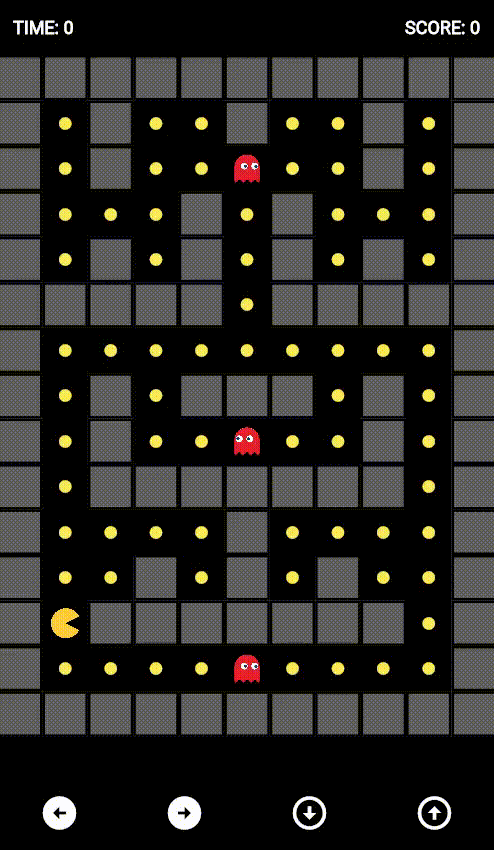

[](https://choosealicense.com/licenses/mit/)

# Flutter Pacman

The game application, make with flutter of the a famous game PacMan.

## Screenshots



## Rodando localmente

Clone o projeto

```bash
  git clone https://github.com/ayusuke7/pacman_flutter
```

Entre no diretório do projeto

```bash
  cd pacman_flutter
```

Instale as dependências

```bash
  flutter pub get packages
```

Inicie o servidor

```bash
  flutter run
```

## Change Board and Barries

The board is mounted based in list with int, when 1 is path and 0 is barried
Obs: enemys its setted in game loop with number 2

```dart
class Levels {

  static final _boardOne = [
    0,0,0,0,0,0,0,0,0,0,0,
    0,1,0,1,1,0,1,1,0,1,0,
    0,1,0,1,1,1,1,1,0,1,0,
    0,1,1,1,0,1,0,1,1,1,0,
    0,1,0,1,0,1,0,1,0,1,0,
    0,0,0,0,0,1,0,0,0,0,0,
    0,1,1,1,1,1,1,1,1,1,0,
    0,1,0,1,0,0,0,1,0,1,0,
    0,1,0,1,1,1,1,1,0,1,0,
    0,1,0,0,0,0,0,0,0,1,0,
    0,1,1,1,1,0,1,1,1,1,0,
    0,1,1,0,1,0,1,0,1,1,0,
    0,1,0,0,0,0,0,0,0,1,0,
    0,1,1,1,1,1,1,1,1,1,0,
    0,0,0,0,0,0,0,0,0,0,0,
  ];

}
```

## Autores

- [@ayusuke7](https://github.com/ayusuke7)
